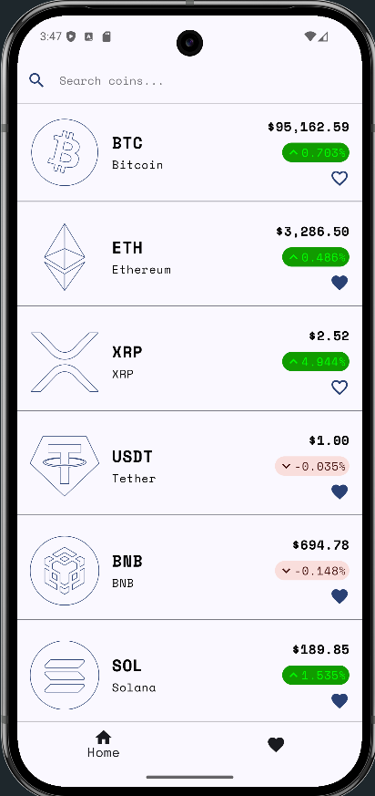
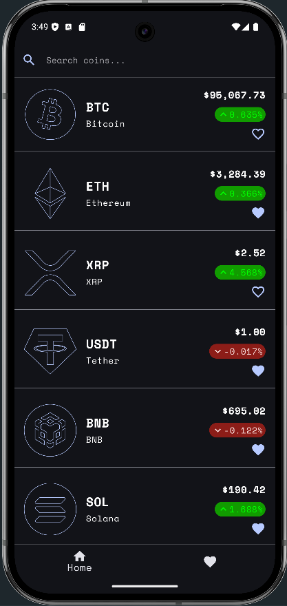
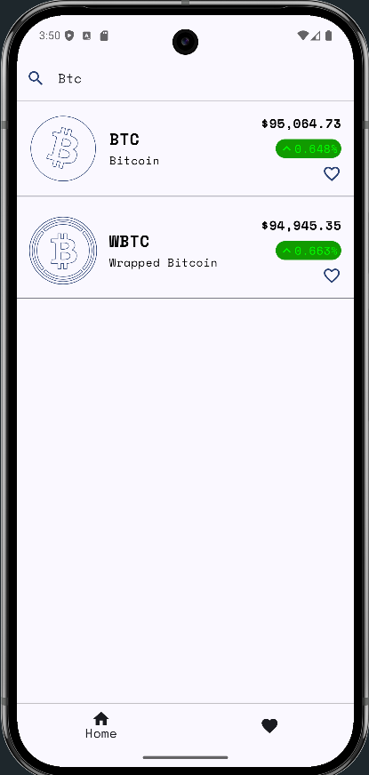
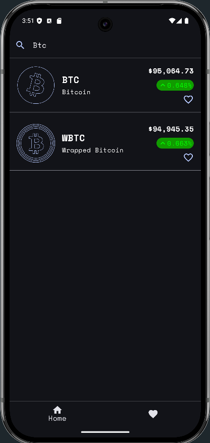
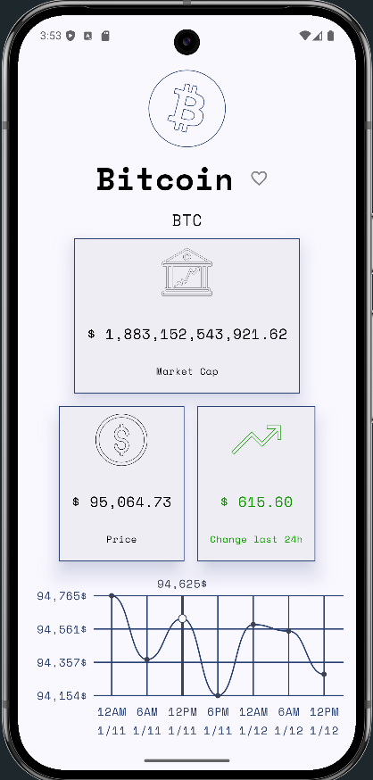
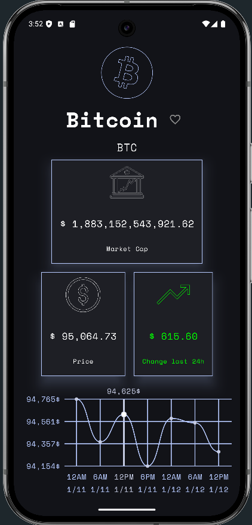
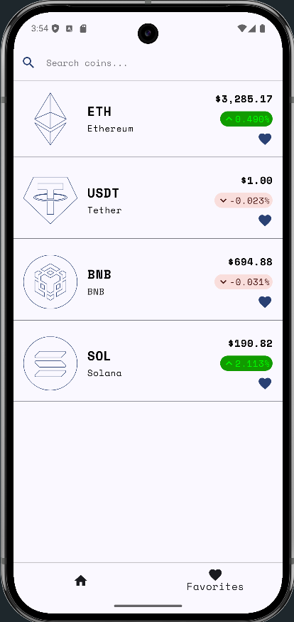
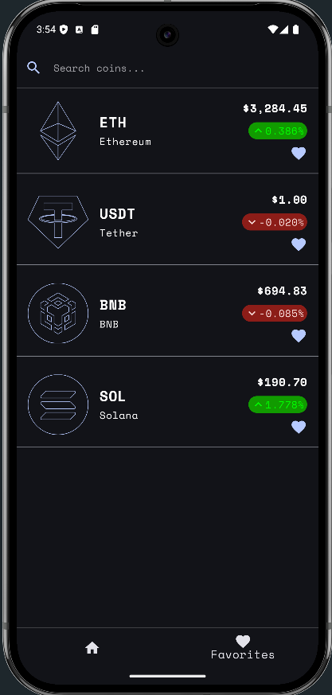
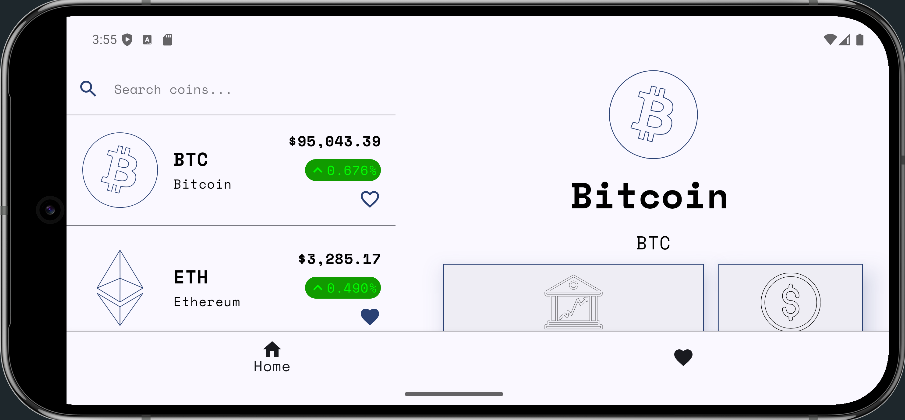
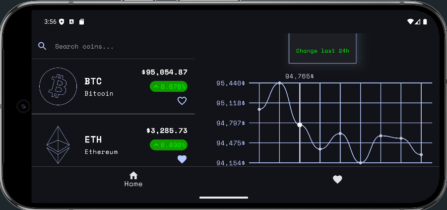

# CryptoTracker

**CryptoTracker** is a mobile application developed in Kotlin, designed for real-time cryptocurrency tracking. It enables users to monitor prices, analyze trends, and access information on various digital currencies through an intuitive interface.

## Features

- ✨ **Real-time data**: View live prices of cryptocurrencies with updates every minute.
- 🎨 **Detailed views**: Access comprehensive information about each cryptocurrency, including interactive charts and key statistics.
- 🔍 **Search functionality**: Quickly find cryptocurrencies by name or abbreviation.
- ❤️ **Favorites management**: Mark your favorite cryptocurrencies for easy access in a dedicated section.
- 🌍 **Dynamic themes**: Automatically adapts to light or dark mode based on your system settings.

## Technologies Used

- **Language**: Kotlin
- **Architecture**: MVVM (Model-View-ViewModel) for a scalable and maintainable codebase.
- **Networking**: Ktor for efficient API communication.
- **UI Framework**: Jetpack Compose for building declarative and modern user interfaces.
- **Dependency Injection**: Koin for managing dependencies and simplifying testing.
- **Persistence**: Room Database for storing and managing user favorites locally.
- **Testing**:
   - JUnit and MockK for unit testing.
   - Espresso for UI testing.
- **API Integration**: CoinCap API 2.0 for fetching cryptocurrency data.
- **Material Design 3**: Adaptive components for an intuitive and consistent user experience.
- **Coroutines**: Simplified asynchronous programming for smoother app performance.

## Screenshots

Here are some screenshots showcasing the app's features:

### Home Screen
|                       Light Mode                       |                      Dark Mode                       |
|:------------------------------------------------------:|:----------------------------------------------------:|
|  |  |

*Description: The main screen displaying a list of cryptocurrencies with live prices.*

### Search Functionality
|                           Light Mode                            |                           Dark Mode                           |
|:---------------------------------------------------------------:|:-------------------------------------------------------------:|
|  |  |

*Description: Search cryptocurrencies by name or abbreviation.*

### Detailed View
|                        Light Mode                        |                       Dark Mode                        |
|:--------------------------------------------------------:|:------------------------------------------------------:|
|  |  |

*Description: Detailed information about a selected cryptocurrency, including an interactive chart.*

### Favorites
|                      Light Mode                      |                     Dark Mode                      |
|:----------------------------------------------------:|:--------------------------------------------------:|
|  |  |

*Description: A list of your favorite cryptocurrencies for quick access.*

### Portrait
|                          Light Mode                           |                          Dark Mode                          |
|:-------------------------------------------------------------:|:-----------------------------------------------------------:|
|  |  |

*Description: Portrait mode.*

## Installation

1. Clone this repository:
   ```bash
   git clone https://github.com/Ivanmw97/CryptoTracker.git
2. Open the project in Android Studio.
3. Sync dependencies and libraries.
4. Run the app on an emulator or a physical device.

## Contributions
Contributions are welcome! To contribute:

1. Fork the repository.
2. Create a branch for your feature or fix:
   ```bash
   git checkout -b feature/new-feature
3. Submit a pull request detailing your changes.
